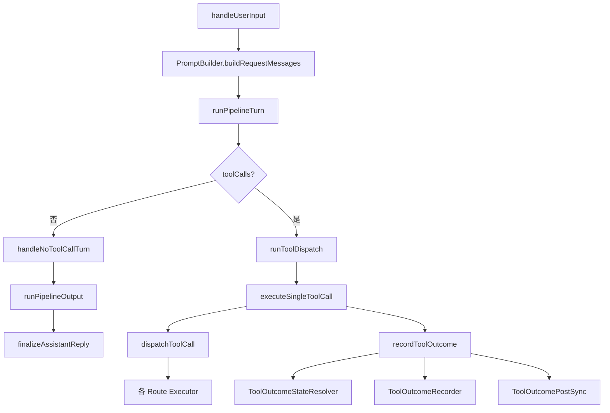

# AgentSession 当前执行链（2026-07）

本文档记录当前 `packages/core/src/agentSession.ts` 的真实执行链、协作者分层，以及哪些逻辑仍留在会话内核里。目的不是重复 `pipeline-cutover-plan.md` 的阶段历史，而是给后续接手者一个**当前代码怎么跑**的地图。

## 一句话结论

- 生产路径已收敛为**单一 pipeline 路径**：不再有 `pipelineMode` / `/pipeline` / legacy/shadow/canary 分支。
- `AgentSession` 的职责已经从“大而全执行器”收敛为：
  1. 持有会话状态（messages / turnCount / abort / compaction / credits / pending edits）
  2. 调度协作者（turn/tool/outcome/trace）
  3. 承担少量**现网行为所有权**（命令确认顺序、tool_result 事件契约、消息持久化时机）
- 工具执行与结果处理已拆成多协作者；真正仍重、且带会话状态副作用的内核，主要剩：
  - `executeSingleToolCall`
  - `dispatchToolCall`
  - `finalizeAssistantReply`
  - `handleNoToolCallTurn`

## 主循环总览

## 协作者分层

### 1. turn 级协作者

这些协作者服务于“一轮 LLM 推进”的边界，不直接感知多会话管理：

- `runPipelineTurn`
  - `StrategyTurnSource`
  - `DefaultLLMHandler`
- `runToolDispatch`
  - `DefaultToolDispatchHandler`
- `runPipelineOutput`
  - `DefaultOutputHandler`
- `handleNoToolCallTurn`
  - `NoToolTurnDecider`
- `finalizeAssistantReply`
  - `TurnFinalizer`

### 2. 工具执行协作者

这些协作者按 route 拆分 `dispatchToolCall` 的执行分支：

- `resolveToolDispatchRoute`：route 决策
- `CommandToolExecutor`：`execute_command` / `start_process`
- `RelayToolExecutor`：`relay_*`
- `DelegatedToolExecutor`：`delegate_task` / `parallel_*`
- `McpToolExecutor`：`mcp__*`
- `GenericToolExecutor`：其余通用工具（快照 + `executeToolCall` + `read_file` 额外提示）

### 3. 工具结果处理协作者

`recordToolOutcome` 目前已经被拆成三层协作者链：

- `ToolOutcomeStateResolver`
  - 解析前置状态：`mutated` / `diagnosed` / `isPending` / `markTransient` / 变更路径
- `ToolOutcomeRecorder`
  - 发 `tool_result`
  - 写 tool 消息进历史
  - 注入 AI hint（如 `commandWasEdited` / `noopEdit`）
- `ToolOutcomePostSync`
  - trace `tool.result`
  - transient 标记
  - screenshot 入队
  - `edits_updated` / `onPendingChanged`

### 4. 会话级协作者

这些协作者有稳定生命周期，应由 `AgentSession` 构造期持有：

- `PromptBuilder`
- `TokenAccountant`
- `ToolDefBuilder`
- `McpController`
- `DelegateRunner`
- `ParallelRunner`
- `RelayToolRunner`
- `CommandGateController`
- `SessionTraceWriter`
- `TurnFinalizer`
- `ToolOutcomeStateResolver`
- `ToolOutcomeRecorder`
- `ToolOutcomePostSync`
- `NoToolTurnDecider`
- `CommandToolExecutor`
- `RelayToolExecutor`
- `DelegatedToolExecutor`
- `McpToolExecutor`
- `GenericToolExecutor`

## 为什么 `GenericToolExecutor` 不是“纯 session 级”

这是本次重构里一个重要边界：

`GenericToolExecutor` 虽然作为协作者实例由 `AgentSession` 持有，但它的 `execute(...)` **必须显式接收 turn runtime**：

- `mode`
- `turnCount`
- `signal`
- `guard`

原因：
- `guard.noteFileRead(path)` 是 **turn 级状态**，用于检测“一轮里是否反复零碎读同一文件”
- 如果把 `guard` 偷偷塞进 constructor，当成 session 级依赖，会把 turn 边界弄坏，造成行为错误

所以当前采用的是：
- **稳定依赖进 constructor**
- **turn 依赖进 execute(runtime)**

这是当前会话层最重要的依赖分层规则之一。

## 仍留在 AgentSession 内核里的行为所有权

出于现网行为兼容与产品要求，以下逻辑暂不下沉：

### 1. 命令确认顺序

用户要求的交互顺序是：

> 先弹出工具卡片 → 再弹确认弹窗 → 用户操作

因此命令门仍通过 `dispatchToolCall -> gateCommand` 保持现顺序。虽有 `CommandGateToolDecider` 这样的纯组件，但它不接生产路径。

### 2. `tool_result` 事件契约

当前前端消费的是一个平铺的大 payload：

- `fileDiff`
- `fileDiffs`
- `noopEdit`
- `readRange`
- `diagnostics`
- `searchResults`
- `fetchResult`
- `powerActivated`
- `resolvedPath`
- `mcpMeta`
- ...

这不是一个健康契约，但它是**现网行为所有权位置**。事件桥 `toolEventBridge` 已完成且有测试，但按 ADR 暂不接生产，避免丢字段或制造双路径并存。

### 3. 消息持久化时机

何时 `persistMessages()`、何时发 `stream_end`、何时触发滚动摘要，这些仍由 `AgentSession` 统一掌握，因为它最了解会话状态与前后顺序约束。

## Session Trace

每个 session 都会落一份 JSONL trace：

- 路径：`<workspace>/.axon/traces/trace-<sessionId>.jsonl`
- writer：`SessionTraceWriter`

当前已覆盖：

### 会话级事件
- `session.trace_ready`
- `session.id_bound`
- `session.created`
- `session.loaded`
- `session.title_updated`
- `workspace.set`

### turn / tool 级事件
- `turn.start`
- `reasoning.delta`
- `text.delta`
- `tool.detected`
- `tool.call`
- `tool.result`
- `tool.result.event`
- `turn.result`
- `turn.end`
- `stream.end`
- `turn.cancelled`
- `status`
- `command.confirm_request`
- `command.blocked`
- `tool.confirm_request`
- `edits_updated`
- `snapshots_listed`

trace 的目标不是替代前端，而是给“这轮到底先有文字还是先有工具”“tool_result 实际发了什么”这类问题提供证据链。

## 后续建议（按收益排序）

### 高收益
1. 真实使用 trace 跑几轮复杂任务，确认行为证据链完整
2. 若再做重构，优先继续瘦 `handleNoToolCallTurn` 的副作用部分
3. 若做新功能，优先基于 trace 提供导出/查看能力

### 中收益
1. 继续把 `recordToolOutcome` 的外壳压到更薄
2. 把部分 session 协作者的依赖契约进一步显式类型化，减少 `any`

### 低收益 / 谨慎
1. 为了“所有东西都从 session/index.ts 导出”而重排模块边界 —— 容易为了统一而统一
2. 为了“每一行逻辑都不在 AgentSession 里”继续过度抽象 —— 会损害可读性

## 当前状态定义

可以把现在的 `AgentSession` 理解为：

> 一个持有会话状态、调度协作者、并保留少量现网行为所有权的执行外壳。

这已经不是“大而全的上帝对象”，但也刻意没有被拆成一堆过度抽象的小碎片。当前结构是“可维护性”和“行为稳定性”之间的平衡点。
